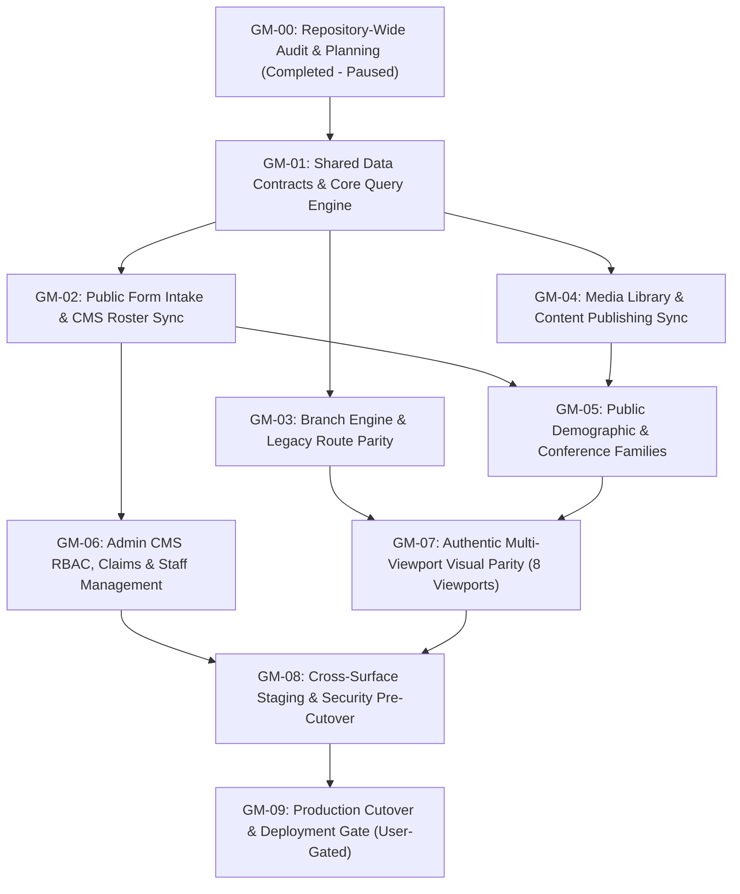

# Master Execution Plan: Sword of the Spirit Ministries (SSMI)

This document is the **single global roadmap** governing all development, integration, conversion, and launch activities across the entire SSMI repository (`c:\Users\Jabu Babb\Documents\Code\Sword`).

It coordinates work across four primary application and infrastructure surfaces:
1. **Public React Website** (`website/`): Public-facing church website built with React 19, Vite, Tailwind CSS, and React Router v7.
2. **Flutter Reference Website** (`flutter-website/`): Original production website built with FlutterFlow/Dart; static build in `build/web`. Strictly read-only reference.
3. **Admin CMS** (`admin/`): Church operations workspace built with React 18, Vite, Tailwind, and Firebase SDK, managing 10 operational collections.
4. **Cloud Functions & Backend** (`cloud-functions/`, `functions/`, Firestore Rules): Firebase Functions v2 (`africa-south1`), security rules, and shared brand blueprint.

---

## 1. Global Strategy & Execution Principles

1. **Explicit Multi-Workstream Architecture:**
   The project encompasses four synchronized workstreams:
   - **Workstream 1: Flutter-to-React Website Conversion** (Detailed 9-milestone technical roadmap preserved intact in Section 4).
   - **Workstream 2: Admin CMS Feature & Operations Platform** (10 operational workspaces, staff onboarding, attendance, and publishing).
   - **Workstream 3: Shared Integration & Site-to-CMS Data Contracts** (Inbound pipelines, Firestore schema enforcement, cross-surface workflows).
   - **Workstream 4: Cross-Cutting Verification, Security & Release Readiness** (Multi-viewport visual comparison, security audit, cutover gate).
2. **Unified, Non-Duplicated Completion Tracking:**
   Completion is tracked exclusively at the **Global Milestone level (GM-00 through GM-09)**. Workstream-specific tasks map directly into these global milestones; there are no separate, parallel percentage trackers or duplicate progress ledgers.
3. **Dependency-Driven Execution:**
   Do not delay Admin CMS work until public website visual conversion is complete. When shared data contracts are stabilized (GM-01 / GM-02), Admin CMS operational tasks and public site features proceed in parallel.
4. **Non-Blocking Open Decisions (DEC-01 through DEC-06):**
   Where a product decision is pending in `USER_ACTIONS.md`, only its specific dependent task waits. All independent eligible work proceeds immediately upon plan approval. In particular, CSV export (`DEC-06`) is pending user scope decision and is **NOT required for launch unless explicitly approved**.
5. **Strict Acceptance Gating:**
   The ~98% visual fidelity target is an acceptance goal judged exclusively by the human reviewer via authentic side-by-side screenshots across 8 viewports. Agents must never claim visual fidelity based on code inspection.

---

## 2. Global Milestone Roadmap Overview



---

## 3. Detailed Global Milestones & Actionable Tasks

### GM-00: Repository-Wide Audit, Architecture Discovery & Planning System
- **Status:** `implemented` / `awaiting_user_review` (Current Run)
- **Surfaces:** Repository-wide (`website/`, `admin/`, `flutter-website/`, `cloud-functions/`, `functions/`).
- **Scope:** Audit all active surfaces, routes, schemas, and rules; establish stable IDs and governance files in `website/automation/`.
- **Completion Gate:** `STATE.json` initialized in `paused` state awaiting user plan review.

---

### GM-01: Shared Data Contracts & Core Query Engine
- **Status:** `pending` (Ready upon user plan approval)
- **Surfaces:** Public Website (`website/`), Shared Functions (`functions/`), Firestore Rules.
- **Referenced IDs:** `PUB-05`, `PUB-08`, `PUB-11`, `PUB-15`, `PUB-16`, `DATA-01`, `DATA-02`; `BUG-02`, `BUG-03`, `BUG-04`.
- **Prerequisites:** GM-00 approved by user.
- **Actionable Tasks:**
  1. **Task DATA-01-T1 (Fix Query Hook):** Refactor `website/src/hooks/useFirestoreQuery.js` and `website/src/lib/firestore.js` to instantiate genuine Firebase SDK `QueryConstraint` objects (`where`, `orderBy`, `limit`) when passed constraint arrays or definition objects (`BUG-02`).
  2. **Task DATA-02-T1 (Normalize FEWDS):** Normalize ministry department access in `MinistriesPage.jsx` and `WelfarePage.jsx` to `m.FEWDS || m.fewds` (`BUG-04`).
  3. **Task DATA-02-T2 (Event Schema Typo Compatibility):** Update event query logic across public pages to query/check both `'mininstryName'` (legacy schema) and `'ministryName'` (`BUG-03`).
  4. **Task PUB-05-T1 (Sermon Ordering):** Ensure `WatchPage.jsx` applies `orderBy('date', 'desc')` without dropping constraints; add title check `sermon.Title || sermon.title`.
  5. *(Optional Dependency)* **Task PUB-01-T2 (Public Nav "My Dashboard"):** Pending user decision `DEC-01`. All other navbar/footer items proceed independently.
- **Automated Verification:** `npm run build` in `website/` exits with code 0; queries return filtered data instead of empty arrays.
- **Handoff:** Update `BUGS.md` (`BUG-02`, `BUG-03`, `BUG-04` -> `Resolved`), update `STATE.json`.

---

### GM-02: Public Form Intake & CMS Roster Synchronization
- **Status:** `pending`
- **Surfaces:** Public Website (`website/`), Admin CMS (`admin/`), Firestore Rules.
- **Referenced IDs:** `PUB-07`, `PUB-10`, `PUB-14`, `PUB-20`, `CMS-01`, `CMS-02`, `CMS-03`, `CMS-04`, `INT-01`, `INT-02`, `INT-03`, `INT-04`; `BUG-01`, `BUG-05`, `DEC-04`.
- **Prerequisites:** GM-01 complete.
- **Actionable Public Website Tasks:**
  1. **Task INT-01-T1 (Registration Routing):** In `RegisterPage.jsx`, route submissions to `COLLECTIONS.REGISTRATIONS` (`registrations`), NOT `requests`. Write schema: `name`, `surname`, `cell`, `branch`, `eventName`, `message`, `date` (`BUG-01`).
  2. **Task INT-02-T1 (Partner & Child Ingestion):** In `BeAPartnerPage.jsx`, write adult partner fields (`DOB`, `Occupation`, string flags `'Yes'`/`'No'`). When children are added, write each child as an individual partner document with `kid: 'Yes'` and `parent: parentDocRef` (`BUG-05`).
  3. **Task INT-03-T1 (Ministry Sign-Up):** In `SignUpModal.jsx`, write submissions to `signUps` collection with `name`, `surname`, `cell`, `branch`, `type`, `date`.
  4. **Task INT-04-T1a (Requests Form UI & Schema Inspection — ELIGIBLE):** Render and validate the `RequestModal.jsx` and `FollowUpModal.jsx` form fields; inspect existing `firestore.rules` `validRequest` rule; run non-production schema tests only. **Do not introduce any new or changed direct-to-Firestore submission writes.** Existing live Flutter and React submission behavior is preserved without modification until `DEC-04` is resolved.
  5. **Task INT-04-T1b (Requests Write Path — BLOCKED on DEC-04):** Any new or changed submission write to `requests` (direct Firestore or callable) is blocked until the user resolves `DEC-04` and confirms path and compatibility requirements.
  6. **Task INT-04-T2 (Callable Migration — BLOCKED on DEC-04):** Migration of forms to `submitPublicRequest` callable Cloud Function is pending `DEC-04` user decision.
- **Actionable Admin CMS Tasks:**
  1. **Task CMS-03-T1 (Registration Roster & Check-In):** In `RegistrationsWorkspacePage.jsx` and `RegistrationDetailPage.jsx`, implement and verify event price parsing, payment toggle (`paid` vs `pending`), reviewer attribution, and multi-session check-in recording. *(VERIFIED in code: `RegistrationDetailPage.jsx` inspected — `checkIns[]` array, `eventSessions()`, `markCheck()`, `paymentStatus`, `paymentDone` confirmed in actual file.)*
  2. **Task CMS-04-T1 (Partner Family & Child Roster):** In `PartnersWorkspacePage.jsx` and `PartnerDetailPage.jsx`, implement and verify rendering of child partner records with "Minor" badge, family link association (`familyLinks`), and user account linking (`linkedUserId`). *(VERIFIED in code: `PartnerDetailPage.jsx` inspected — `familyLinks[]`, `handleLinkUser()`, `handleAddFamilyLink()`, dual `partners`+`users` write confirmed in actual file.)*
  3. **Task CMS-05-T2 (Requests Processing):** In `RequestsWorkspacePage.jsx` and `RequestDetailPage.jsx`, implement request review, branch assignment, admin notes, and acknowledge action. *(Status: PROPOSED — `RequestDetailPage.jsx` was not individually inspected this session; verify against actual file before scheduling detailed sub-tasks.)*
  4. **Task CMS-06-T1 (Sign-Up Queue):** In `MinistrySignUpsWorkspacePage.jsx`, implement branch-scoped review and volunteer acknowledgment. *(Status: PROPOSED — `MinistrySignUpsWorkspacePage.jsx` was not individually inspected this session; verify against actual file before scheduling detailed sub-tasks.)*
- **Automated Verification:** `npm run build` in both `website/` and `admin/`; execute all 4 cross-surface intake tests defined in `TESTING.md`.
- **Handoff:** Update `BUGS.md` (`BUG-01`, `BUG-05` -> `Resolved`), update `STATE.json`.

---

### GM-03: Dynamic Branch Engine & Legacy Route Parity
- **Status:** `pending`
- **Surfaces:** Public Website (`website/`), Admin CMS (`admin/`).
- **Referenced IDs:** `PUB-04`, `PUB-04a`–`PUB-04i`, `PUB-18`, `CMS-10`, `INT-06`; `BUG-07`, `DEC-05`.
- **Prerequisites:** GM-01 complete.
- **Actionable Public Website Tasks:**
  1. **Task PUB-04-T1 (Branch Slug Resolution):** In `BranchTemplatePage.jsx`, standardize slug matching across all 9 branches (`Online`, `Mbabane`, `Siteki`, `Hlutsi`, `Ludzeludze`, `EMalahleni`, `Boksburg`, `Orange Farm`, `Lagos`).
  2. **Task PUB-04-T2 (Remove Dummy Cities):** Replace placeholder South African cities in `MinistryPage.jsx` and `SocialsPage.jsx` with the 9 official SSMI branches (`BUG-07`).
  3. **Task PUB-04-T4 (Service Times & Bios):** Align service times parsing and fallback pastoral bios with `scripts/backfill-branch-landing-content.mjs`.
  4. *(Optional Dependency)* **Task PUB-04-T3 (Legacy Redirects vs Templates):** Pending user decision `DEC-05`. Rendered legacy templates proceed independently.
- **Actionable Admin CMS Tasks:**
  1. **Task CMS-10-T1 (Branch Profile & Media Upload):** In `BranchWorkspacePage.jsx`, verify editing of branch contact info, location PIN (GeoPoint), banking details, service times array, pastor bio, and hero image/video uploads to Firebase Storage (`storage.rules`).
- **Automated Verification:** `npm run build` in `website/` and `admin/`; manual review of all 9 branch routes.
- **Handoff:** Update `BUGS.md` (`BUG-07` -> `Resolved`), update `STATE.json`.

---

### GM-04: Media Library, Content Publishing & Parameter Routing
- **Status:** `pending`
- **Surfaces:** Public Website (`website/`), Admin CMS (`admin/`).
- **Referenced IDs:** `PUB-02`, `PUB-06`, `PUB-09`, `CMS-08`, `CMS-09`, `INT-05`; `BUG-06`, `BUG-08`, `DEC-02`.
- **Prerequisites:** GM-01 complete.
- **Actionable Public Website Tasks:**
  1. **Task PUB-06-T1 (Podcasts Stream):** Connect `PodcastsPage.jsx` to `COLLECTIONS.PODCAST` (`podcast` collection) ordered by `date` desc; render episode cards matching Flutter `podcasts_widget.dart` (`BUG-06`).
  2. **Task PUB-09-T1 (Event Query Param):** Update `EventPage.jsx` to accept both `?id=` and legacy `?event=` query parameters (`BUG-08`).
  3. **Task PUB-02-T1 (Homepage Realtime Sync):** Verify `HomePage.jsx` subscribes via `onSnapshot` to `websiteContent/homepage` and updates video player and theme artwork in real time.
- **Actionable Admin CMS Tasks:**
  1. **Task CMS-09-T1 (Homepage Content Publisher):** In `WebsiteContentPage.jsx`, implement saving and previewing latest sermon URL, published date, theme of the year title, subtitle, and responsive artwork links. *(VERIFIED in code: `WebsiteContentPage.jsx` inspected — reads/writes `websiteContent/homepage` with fields `latestSermonVideoUrl`, `yearThemeTitle`, `yearThemeDesktopImageUrl`, `yearThemeMobileImageUrl` confirmed in actual file.)*
  2. **Task CMS-08-T1 (Media Manager):** In `SermonsWorkspacePage.jsx` and `SermonDetailPage.jsx`, implement manual sermon and podcast episode entry and publication. *(Status: PROPOSED — `SermonsWorkspacePage.jsx` and `SermonDetailPage.jsx` were not individually inspected this session; verify actual fields and save logic before scheduling detailed sub-tasks. Task CMS-08-T2 automated YouTube API sync is pending `DEC-02`; manual entry proceeds once code is verified.)*
- **Automated Verification:** `npm run build` in `website/` and `admin/`; test live sync between CMS save and public homepage.
- **Handoff:** Update `BUGS.md` (`BUG-06`, `BUG-08` -> `Resolved`), update `STATE.json`.

---

### GM-05: Public Demographic Page Families & Conference Landings
- **Status:** `pending`
- **Surfaces:** Public Website (`website/`).
- **Referenced IDs:** `PUB-15a`–`PUB-15i`, `PUB-16a`–`PUB-16c`; `BUG-03`.
- **Prerequisites:** GM-01, GM-02, GM-04 complete.
- **Actionable Tasks:**
  1. **Task PUB-15-T1 (Demographic Event Queries):** Standardize event queries across all 8 demographic pages (`SuperKidsPage`, `YouthPage`, `YoungAdultsPage`, `SinglesPage`, `CouplesPage`, `ForMenPage`, `ForWomenPage`, `SchoolOfMinistryPage`) to filter by `mininstryName` and `ministryName`.
  2. **Task PUB-16-T1 (Conference Landings):** Connect `CampYoloPage.jsx`, `FireConferencePage.jsx`, and `SupermanConferencePage.jsx` to real Firestore conference events and theme assets.
  3. **Task PUB-16-T2 (Conference CTAs):** Wire registration buttons to `SignUpModal` or `/register` with pre-selected event names.
- **Automated Verification:** `npm run build` in `website/`; browser verification of demographic and conference pages.

---

### GM-06: Admin CMS Staff Management, RBAC & Operational Workflows
- **Status:** `pending`
- **Surfaces:** Admin CMS (`admin/`), Cloud Functions (`cloud-functions/`), Firestore Rules.
- **Referenced IDs:** `CMS-01`, `CMS-02`, `CMS-05`, `CMS-07`, `CMS-11`; `DEC-03`, `DEC-06`.
- **Prerequisites:** GM-02 complete.
- **Actionable Tasks:**
  1. **Task CMS-11-T1a (Staff Profile Viewing — ELIGIBLE):** In `UsersAccessPage.jsx` and `UserAccessRequestDetailPage.jsx`, implement read-only display of staff access requests, current role labels, and branch/ministry scope assignments. No writes to roles, claims, branch access, or security rules. *(Verified: `UserAccessRequestDetailPage.jsx` inspected; `handleApprove()` currently writes Firestore only — read display is safe to proceed.)*
  2. **Task CMS-11-T1b (Role \u0026 Scope Writes — BLOCKED on DEC-03):** Any write that grants or changes effective staff roles, branch access, or custom claims in `UserAccessRequestDetailPage.jsx` (including the existing `handleApprove()` Firestore write path) is blocked until `DEC-03` is resolved and the authorization path is verified.
  3. **Task CMS-11-T2 (Callable `setAdminAccess` Integration — BLOCKED on DEC-03):** Invoking callable `setAdminAccess` Cloud Function on approval is pending `DEC-03` user decision.
  4. **Task CMS-02-T1 (Dashboard Scope Engine):** In `DashboardPage.jsx`, verify metric counters and branch-scoped queue filtering for `care_team` and `branch_editor` roles. *(Status: PROPOSED — dashboard scoping logic not directly inspected in this session; verify against actual `DashboardPage.jsx` before scheduling.)*
  5. **Task CMS-07-T1 (Events Scheduling Engine):** In `EventsWorkspacePage.jsx` and `EventDetailPage.jsx`, implement event recurrence editor, session definitions, and dual `mininstryName` / `ministryName` publishing. *(VERIFIED in code: `EventsWorkspacePage.jsx` inspected — `recurrenceEnd`, `recurrenceDays`, `sessions[]`, and `mininstryName` legacy typo confirmed in actual file.)*
  6. **Task CMS-05-T1 (CSV Data Export):** **PENDING USER SCOPE DECISION (`DEC-06`).** NOT required for launch unless approved by user. Core workspace queue operations proceed independently.
- **Automated Verification:** `npm run build` in `admin/`; `npm run lint` in `cloud-functions/`. Test role switching and scope boundaries.

---

### GM-07: Authentic Multi-Viewport Visual Parity & Responsive Alignment
- **Status:** `pending`
- **Surfaces:** Public Website (`website/`) vs Flutter Reference (`flutter-website/`).
- **Referenced IDs:** All public features `PUB-01` to `PUB-20`; `BUG-09`.
- **Prerequisites:** GM-01 through GM-05 complete.
- **Actionable Tasks:**
  1. **Task QA-01-T1 (Deprecate Duplicate Baseline):** Remove invalid duplicate checksum baseline in `website/docs/verification/` (`BUG-09`).
  2. **Task QA-01-T2 (Capture Authentic Screenshots):** Capture side-by-side screenshots between live Flutter build (`flutter-website/build/web`) and React preview (`website/`) across all **8 designated viewports**: `375px`, `478px`, `479px`, `767px`, `990px`, `991px`, `1280px`, `1440px`.
  3. **Task QA-01-T3 (Visual Token Alignment):** Audit and adjust card radii (`20px` to `30px`), typography weights, brand colors (`#192431`, `#C97303`, `#FBFBFB`), and transition edges (478px/479px, 990px/991px).
  4. **Task QA-01-T4 (Submit for Human Acceptance):** Present comparison sheets to user via `USER_TEST_REPORTS.md` for human visual fidelity review (~98% target).
- **Automated Verification:** All captured artifacts have unique, genuine SHA256 hashes. Explicit user sign-off in `USER_TEST_REPORTS.md`.
- **Handoff:** Update `BUGS.md` (`BUG-09` -> `Resolved`), update `STATE.json`.

---

### GM-08: Cross-Surface Integration, Staging Verification & Pre-Cutover
- **Status:** `pending`
- **Surfaces:** Entire Repository (`website/`, `admin/`, `cloud-functions/`, Firestore Rules).
- **Prerequisites:** GM-06 and GM-07 complete.
- **Actionable Tasks:**
  1. **Task INT-ALL-T1 (End-to-End Journey Verification):** Execute all 6 Cross-Surface Journeys (`INT-01` through `INT-06`) on staging; verify data flows seamlessly from public forms to CMS workspaces.
  2. **Task SEC-01-T1 (Security Rules Audit):** Validate production `firestore.rules` and `storage.rules` against unauthorized access and ensure no keys are exposed.
  3. **Task QA-02-T1 (Production Build & Accessibility):** Run production builds and bundle analysis; verify zero 404s and lighthouse scores.
- **Completion Gate:** User signs off pre-cutover checklist in `USER_TEST_REPORTS.md`.

---

### GM-09: Production Cutover & Deployment Gate
- **Status:** `pending` (Approval-Gated)
- **Surfaces:** Firebase Hosting (`firebase.json`, `.firebaserc`).
- **Prerequisites:** GM-08 complete and explicit written user approval in `USER_ACTIONS.md`.
- **Actionable Tasks:**
  1. Update `firebase.json` hosting targets to map primary public domain to `website/dist`.
  2. Deploy security rules, functions, and hosting targets via Firebase CLI.
  3. Execute production smoke tests on public domain and Admin CMS.
- **Completion Gate:** Client and human user deployment sign-off.

---

## 4. Workstream: Flutter-to-React Website Conversion

This section preserves the comprehensive 9-milestone technical conversion specification established during the initial audit. It serves as the primary technical reference for Public Website work:

### Conversion Milestone 0: Audit, Baseline Discovery & Workflow Creation *(Mapped to GM-00)*
- **Status:** Complete (Current run).
- **Scope:** Repository inspection, defect discovery, and automation system initialization under `website/automation/`.

### Conversion Milestone 1: Firestore Query Engine Standardization & Schema Field Integrity *(Mapped to GM-01)*
- **Prerequisites:** GM-00 approved.
- **Affected React Files:** `website/src/hooks/useFirestoreQuery.js`, `website/src/lib/firestore.js`, `website/src/pages/WatchPage.jsx`, `website/src/pages/GivePage.jsx`, `website/src/pages/FireConferencePage.jsx`, `website/src/pages/SupermanConferencePage.jsx`, `website/src/pages/MinistriesPage.jsx`, `website/src/pages/WelfarePage.jsx`.
- **Technical Work:** Refactor `useFirestoreQuery.js` to parse constraint objects into Firebase `QueryConstraint` instances (`BUG-02`); normalize `FEWDS` department access (`BUG-04`); support `'mininstryName'` event query field (`BUG-03`); fix sermon ordering on `WatchPage`.

### Conversion Milestone 2: Form Intake Pipelines, Data Routing & Child Record Integration *(Mapped to GM-02)*
- **Prerequisites:** GM-01 complete.
- **Affected React Files:** `website/src/pages/RegisterPage.jsx`, `website/src/pages/BeAPartnerPage.jsx`, `website/src/components/modals/SignUpModal.jsx`, `website/src/components/modals/RequestModal.jsx`, `website/src/components/modals/FollowUpModal.jsx`.
- **Technical Work:** Route `/register` to `registrations` collection with individual fields (`BUG-01`); align `/be-a-partner` parent fields and create separate child partner documents with `kid: 'Yes'` and `parent: parentRef` (`BUG-05`); verify modal form submissions to `signUps` and `requests`.

### Conversion Milestone 3: Dynamic Branch Engine & Legacy Route Parity *(Mapped to GM-03)*
- **Prerequisites:** GM-01 and GM-02 complete.
- **Affected React Files:** `website/src/pages/BranchTemplatePage.jsx`, `website/src/pages/BranchGivePage.jsx`, `website/src/pages/SocialsPage.jsx`, `website/src/app/routes.jsx`, `website/src/features/branches/BranchCard.jsx`.
- **Technical Work:** Standardize slug matching for all 9 branches; replace placeholder South African cities with official branches (`BUG-07`); align service times and pastoral bios; test 9 legacy routes (`/legacy/*`).

### Conversion Milestone 4: Content Directory, Query Parameter Mapping & Media Parity *(Mapped to GM-04)*
- **Prerequisites:** GM-01 complete.
- **Affected React Files:** `website/src/pages/PodcastsPage.jsx`, `website/src/pages/MinistryPage.jsx`, `website/src/pages/EventPage.jsx`, `website/src/pages/EventsPage.jsx`, `website/src/pages/WatchPage.jsx`.
- **Technical Work:** Subscribe `PodcastsPage.jsx` to `COLLECTIONS.PODCAST` (`BUG-06`); accept both `?id=` and `?event=` on `EventPage.jsx` (`BUG-08`); ensure responsive sizing for media embeds.

### Conversion Milestone 5: Life Stages, Discipleship & Conference Page Families *(Mapped to GM-05)*
- **Prerequisites:** GM-01, GM-02, and GM-04 complete.
- **Affected React Files:** `SuperKidsPage.jsx`, `YouthPage.jsx`, `YoungAdultsPage.jsx`, `SinglesPage.jsx`, `CouplesPage.jsx`, `ForMenPage.jsx`, `ForWomenPage.jsx`, `SchoolOfMinistryPage.jsx`, `CampYoloPage.jsx`, `FireConferencePage.jsx`, `SupermanConferencePage.jsx`.
- **Technical Work:** Standardize event queries to filter by `mininstryName`; display real conference events; connect registration CTA buttons to modals or `/register`.

### Conversion Milestone 6: Multi-Viewport Responsive & Visual Fidelity Pass *(Mapped to GM-07)*
- **Prerequisites:** GM-01 through GM-05 complete.
- **Affected React Files:** `index.css`, `tailwind.config.js`, `SiteHeader.jsx`, `SiteFooter.jsx`, `MobileDrawer.jsx`, page components.
- **Technical Work:** Deprecate duplicate baseline hashes (`BUG-09`); capture authentic side-by-side screenshots at all 8 viewports (`375`, `478`, `479`, `767`, `990`, `991`, `1280`, `1440px`); audit card radii, typography, spacing, colors; submit to user for ~98% visual review.

### Conversion Milestone 7: Cross-App Integration, Admin CMS Synchronization & Pre-Cutover *(Mapped to GM-08)*
- **Prerequisites:** GM-06 and GM-07 complete.
- **Scope:** End-to-end verification of all public intake flows, CMS workspaces, static asset links, and production bundle check.

### Conversion Milestone 8: Cutover & Production Deployment Gate *(Mapped to GM-09)*
- **Prerequisites:** GM-08 complete and explicit written user approval.
- **Scope:** Update `firebase.json` hosting targets, deploy rules and functions, live production smoke tests.

---

## 5. Workstream: Admin CMS Feature & Operational Platform

The Admin CMS is an active operational system with 10 workspaces. Its implementation tasks are structured as distinct deliverables:

```
[CMS Workspaces Layout]
/                          -> DashboardPage.jsx (Live metrics & branch scoping)
/workspace/requests        -> RequestsWorkspacePage.jsx (Inbound care & prayer queue)
/workspace/registrations   -> RegistrationsWorkspacePage.jsx (Event attendance, payment & sessions)
/workspace/sign-ups        -> MinistrySignUpsWorkspacePage.jsx (Volunteer sign-ups queue)
/workspace/partners        -> PartnersWorkspacePage.jsx (Member directory & child linking)
/workspace/events          -> EventsWorkspacePage.jsx (Event publishing & recurrence)
/workspace/sermons         -> SermonsWorkspacePage.jsx (Media management: YouTube/Podcast/FB)
/workspace/website-content -> WebsiteContentPage.jsx (Homepage sermon & theme publisher)
/workspace/branches        -> BranchWorkspacePage.jsx (Branch profiles, service times & media)
/workspace/ministries      -> MinistriesWorkspacePage.jsx (FEWDS categories & volunteer toggles)
/workspace/users           -> UsersAccessPage.jsx (Staff onboarding, RBAC & scope approval)
```

### Actionable CMS Deliverables:
1. **CMS-01 (Intake Pipeline Alignment):** Support complete schema fields from public site in `RegistrationsWorkspacePage` and `PartnersWorkspacePage` (Scheduled in GM-02).
2. **CMS-02 (Minor Child Record Association):** Support viewing and editing child partner records linked via `kid: 'Yes'` and `parent: parentRef` in `PartnersWorkspacePage` and `PartnerDetailPage` (Scheduled in GM-02).
3. **CMS-03 (Attendance & Check-In):** Verify payment status toggles (`paid` vs `pending`) and multi-session check-in recording in `RegistrationDetailPage` (Scheduled in GM-02).
4. **CMS-04 (Staff Access & Scope Approval):** Implement user approval flow in `UserAccessRequestDetailPage`, assigning roles and branch/ministry scopes. *(Callable `setAdminAccess` integration pending `DEC-03`; Firestore user doc updates proceed; Scheduled in GM-06).*
5. **CMS-05 (Data Export):** CSV export buttons in `RegistrationsWorkspacePage` and `PartnersWorkspacePage`. **Pending user scope decision (`DEC-06`); NOT required for launch unless approved.** (Scheduled in GM-06).
6. **CMS-06 (Hero Media Storage Upload):** Validate hero image/video uploads to Firebase Storage in `BranchWorkspacePage` against `storage.rules` (Scheduled in GM-03).

---

## 6. Workstream: Shared Integration & Site-to-CMS Data Contracts

| Journey ID | Public Action | Firestore Target | Validation Rule (`firestore.rules`) | CMS Destination Workspace | Actionable CMS Task |
| :--- | :--- | :--- | :--- | :--- | :--- |
| **INT-01** | Submit Event Registration (`/register`) | `registrations` collection | `validRegistration(data)` | `RegistrationsWorkspacePage.jsx` | Review attendance, toggle payment status, record session check-in |
| **INT-02** | Submit Partner Application (`/be-a-partner`) | `partners` collection (Adult + Child docs) | `validPartner(data)` | `PartnersWorkspacePage.jsx` | Acknowledge partner, view linked minor records, link user account |
| **INT-03** | Submit Ministry Volunteer (`SignUpModal.jsx`) | `signUps` collection | `validSignUp(data)` | `MinistrySignUpsWorkspacePage.jsx` | Acknowledge sign-up, tag department, route to local branch |
| **INT-04** | Submit Prayer / Testimony (`RequestModal.jsx`) | `requests` collection | `validRequest(data)` | `RequestsWorkspacePage.jsx` | Review request, assign branch, record follow-up notes |
| **INT-05** | Publish Homepage Sermon / Theme | `websiteContent/homepage` | `canManageContent()` | `WebsiteContentPage.jsx` | Save latest sermon URL & theme images -> syncs to `HomePage.jsx` |
| **INT-06** | Edit Branch Profile & Service Times | `branches` collection | `canManageContent()` | `BranchWorkspacePage.jsx` | Edit landing content, service times -> syncs to `BranchTemplatePage.jsx` |
